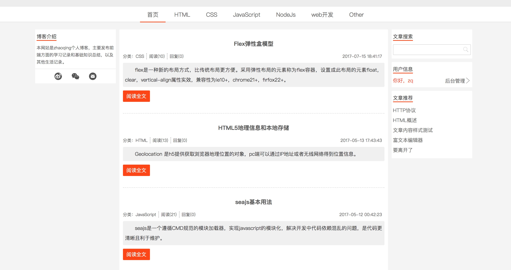
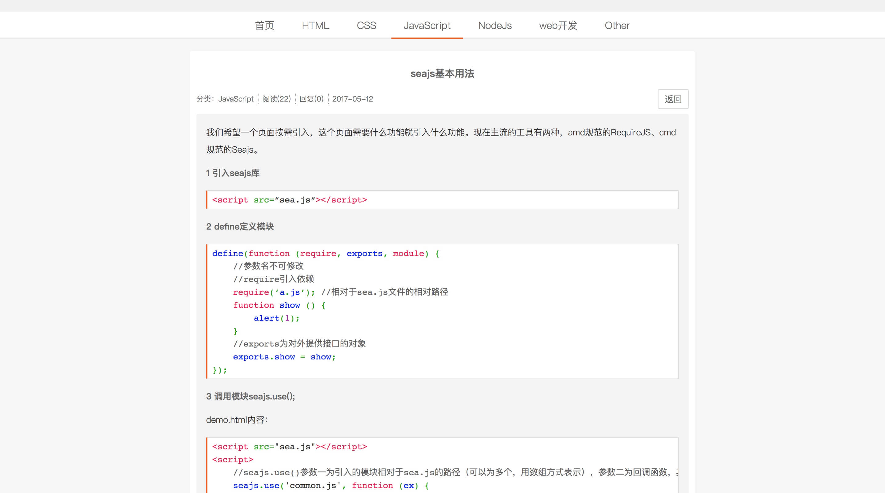
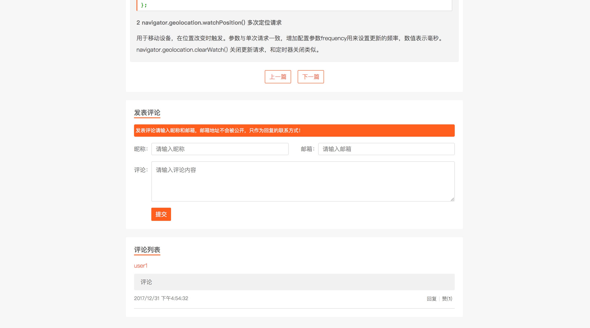
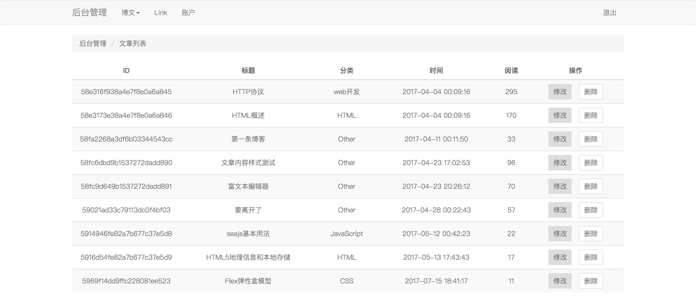
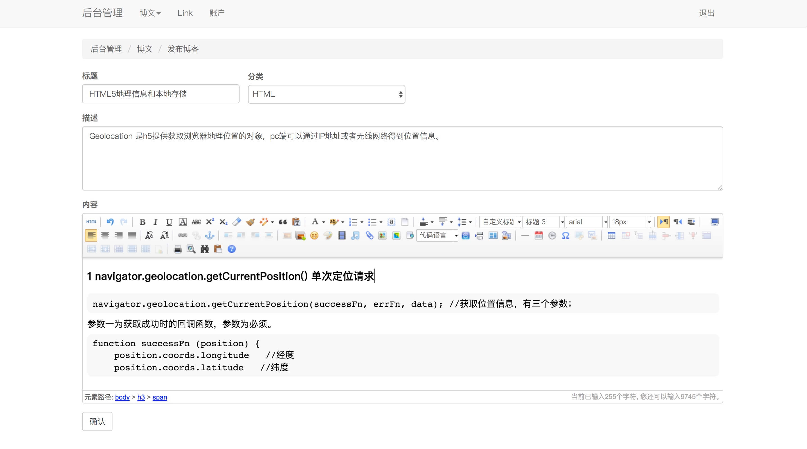
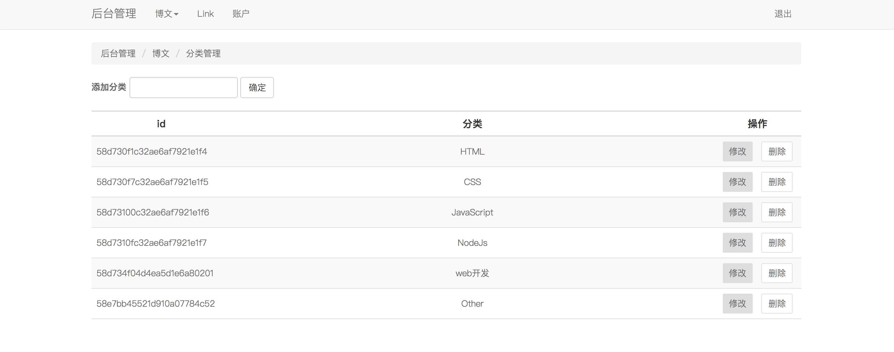

# 博客网站

一个发布博客的网站，使用nodejs + mongodb，前端使用 jquery + less。

地址：[www.zqblog.top](http://47.75.89.71);

## 启动

1. `git clone`  
     
2. `npm install`   

3. 在项目根目录下创建`db`文件夹，用来存放数据。 
    
4. 去官网下载`mongodb`并解压。

5. 打开终端进入`mongodb/bin`文件夹，输入`./mongod --dbpath=/Users/zhaoqing/Desktop/blog/db --port=27017 `

6. 终端进入项目，输入 `node app.js`

7. 启动成功，在浏览器中访问 `localhost:8088`

8. 进入`public`目录，输入`npm install`安装`less`等依赖，输入`gulp watch`监听`less`和`js`文件的改动。

>  其中`/Users/zhaoqing/Desktop` 为项目存放路径。连接成功后会打印 `connection accepted`。

## 界面

### 博客首页

### 博客详情  
使用prettify实现代码高亮。

### 评论

### 后台管理

在首页点击`后台管理` 或访问 `localhost:8088/admin`可进入后台管理登录页面，样式布局使用`bootstrap`。

博客内容编辑使用markdown语法，可编辑和预览，markdown转html使用[HyperDown.js](https://github.com/SegmentFault/HyperDown.js)。

首页博客分类可增删改。

