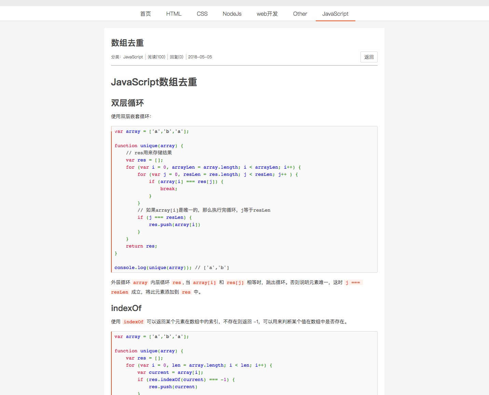
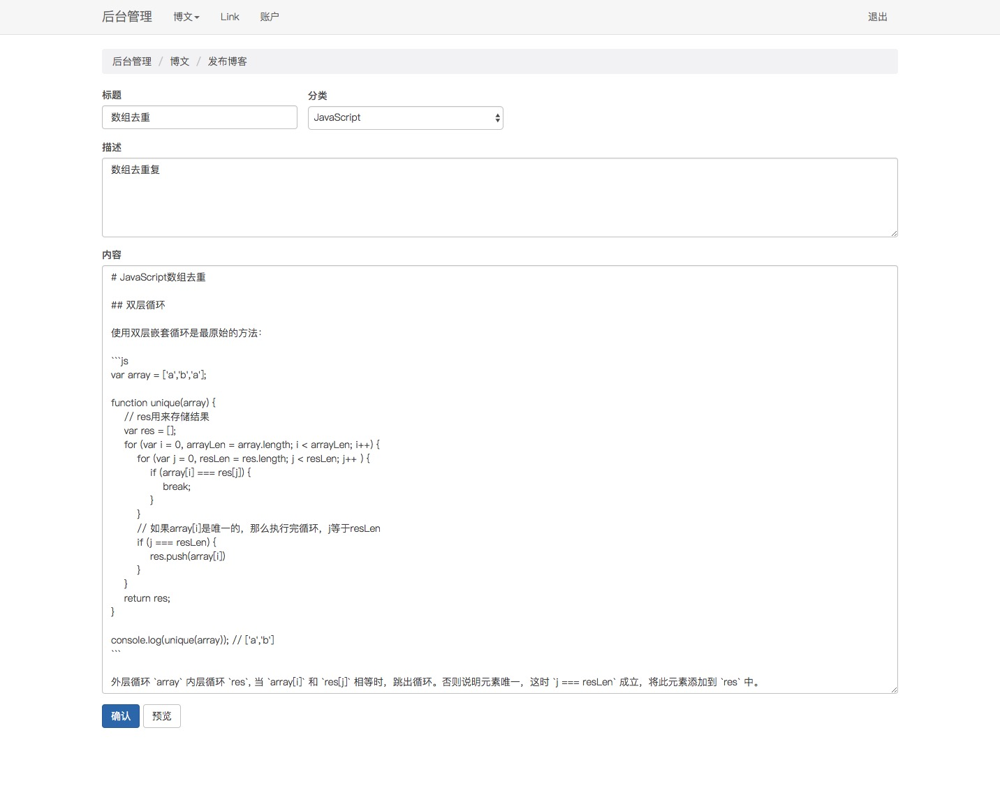

# 博客网站

一个发布博客的网站，使用nodejs + mongodb，前端使用 jquery + less。

## 启动

1. `git clone`  
     
2. `npm install`   

3. 在项目根目录下创建`db`文件夹，用来存放数据。 
    
4. 去官网下载`mongodb`并解压。

5. 打开终端进入`mongodb/bin`文件夹，输入`./mongod --dbpath=/Users/zhaoqing/Desktop/blog/db --port=27017 `

6. 终端进入项目，输入 `node app.js`

7. 启动成功，在浏览器中访问 `localhost:8088`

>  其中`/Users/zhaoqing/Desktop` 为项目存放路径。连接成功后会打印 `connection accepted`。

## 界面

博客首页
 

使用prettify实现代码高亮。

博客详情
 

评论
 

在首页点击`后台管理` 或访问 `localhost:8088/admin`可进入后台管理登录页面，输入用户名`zq`，密码`123`点击登录 (用户名和密码在代码中写死）样式布局使用`bootstrap`。

文章列表
 

博客内容编辑使用百度ueditor富文本编辑器。

发布博客
 

首页博客分类可增删改。

博客分类
 

